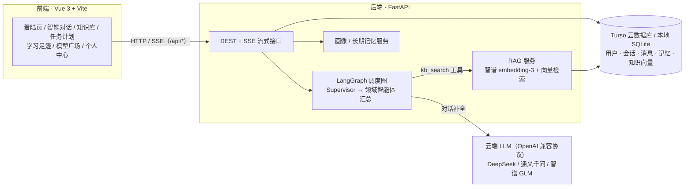

# 智学方舟 zhixue-ark

> 「大学里的事，交给一艘方舟。」—— 面向大学生的校园多智能体 AI 平台：一个统一聊天入口，五位领域智能体共享一份用户画像与长期记忆，由调度智能体（Supervisor）自动拆解任务，知识库回答自带引用溯源。

    

## 在线体验

| 端 | 地址 |
| --- | --- |
| 前端（Vercel） | <https://zhixue-ark.vercel.app> |
| 后端 API（Render） | <https://zhixue-ark.onrender.com/api/health> |

> 免费层提示：Render 后端 15 分钟无访问会休眠，**首次打开需等约 50 秒冷启动**，之后再访问即恢复秒开。

## 核心特性

| 能力 | 说明 |
| --- | --- |
| 统一入口 | 一次提问即可，无需选择「该问谁」；意图模糊时智能体先澄清追问 |
| 五位领域智能体 | 学习助手 / 竞赛指导 / 科研助手 / 求职指导 / 生活服务，另设通用助手兜底 |
| 可解释的调度 | LangGraph 状态图驱动，任务规划、分发、工具调用以时间线形式对用户透明 |
| 私有知识可溯源 | 上传课件/讲义到知识库，回答附引用角标，可核查原文片段与相似度分数 |
| 画像与记忆共享 | 用户画像与长期记忆被所有智能体共享，对话结束后自动提炼新记忆 |
| 多用户与 BYOK | 账号级数据隔离；用户自带 API Key（掩码存储、优先级高于平台 Key、不限量） |

## 系统架构



对话全程经 SSE 推送结构化帧（`meta` → `plan` → `agent_start` → `tool` → `citations` → `delta` → `done`），前端渲染为回答上方的可解释时间线。

## 技术栈

| 层 | 组件 |
| --- | --- |
| AI 层 | LangGraph（状态图编排）· LangChain OpenAI（工具绑定 / ReAct）· DeepSeek / 通义千问 / 智谱 GLM（OpenAI 兼容，可切换自动回落）· 智谱 embedding-3（向量化） |
| 服务层 | Vue 3 + Vite + 原生 CSS · FastAPI + Uvicorn（REST + SSE）· SQLAlchemy 2.0 · Pydantic Settings |
| 部署层 | Vercel（前端静态托管 + /api 反代）· Render（后端容器）· Turso libSQL（云数据库，向量同库存储）· PBKDF2 + HMAC Token 认证 |

**纯 CPU 可运行，无 GPU 与外部中间件依赖。**

## 快速开始（本地）

Windows 用户可直接双击 `启动平台.bat` 一键拉起前后端；或手动执行：

```bash
# ① 后端：装依赖、配 Key、起服务（8000 端口）
cd backend && cp .env.example .env && pip install -r requirements.txt
# 编辑 backend/.env，至少填入一家供应商的 API Key（GLM 有永久免费档）
uvicorn app.main:app --port 8000

# ② 前端：装依赖、起开发服务器（5173 端口，/api 自动代理到 8000）
cd frontend && npm install && npm run dev
```

浏览器访问 `http://localhost:5173`。首次启动自动建表并初始化本地 SQLite（`backend/data/app.db`）。

## 环境变量（backend/.env）

| 变量 | 必填 | 说明 |
| --- | --- | --- |
| `LLM_PROVIDER` | 否 | 默认供应商：`deepseek` / `qwen` / `glm` |
| `DEEPSEEK_API_KEY` / `QWEN_API_KEY` / `GLM_API_KEY` | **至少一家** | 三家均为 OpenAI 兼容协议；嵌入服务复用 `GLM_API_KEY` |
| `FALLBACK_PROVIDER` | 否 | 兜底供应商：所选供应商未配 Key 时自动切换 |
| `TURSO_DATABASE_URL` / `TURSO_AUTH_TOKEN` | 否 | 配置后业务数据 + 知识库向量持久化到 Turso 云库；留空回落本地 SQLite |
| `DATABASE_URL` / `HOST` / `PORT` | 否 | 本地库连接串与监听配置（有默认值） |

完整清单见 [backend/.env.example](backend/.env.example)。密钥只存环境变量，不入 Git。

## 端到端体验路径（4 步）

1. **访问** 前端地址，注册 / 登录
2. **在聊天框输入**「这道二叉树题帮我讲讲」（保持底部「知识库 · 检索开」「记忆 · 运用开」）
3. **观察调度时间线实时推进**：Supervisor 识别意图 → 分派学习助手 → 自动检索知识库 → 流式生成回答
4. **获得带「参考来源 [1]」角标的回答**：点击角标核查原文，或一键「✦ 转为我的计划」沉淀为待办

## 部署

| 平台 | 职责 | 关键配置 |
| --- | --- | --- |
| Vercel | 前端静态托管 | Root Directory = `frontend`；`vercel.json` 将 `/api/*` 反代到 Render |
| Render | FastAPI 后端 | Root Directory = `backend`；Start = `uvicorn app.main:app --host 0.0.0.0 --port $PORT`；环境变量在控制台配置 |
| Turso | libSQL 云数据库 | 创建数据库 + Token 后，将 URL / Token 填入 Render 环境变量，重启不丢数据 |

## 项目结构

```
zhixue-ark/
├── frontend/                        # Vue 3 + Vite 前端
│   ├── index.html
│   ├── package.json
│   ├── vite.config.js               # 开发服务器（/api 代理到 8000）
│   ├── vercel.json                  # 生产环境 /api 反代到 Render
│   └── src/
│       ├── main.js                  # 应用入口
│       ├── App.vue                  # 应用外壳 + 智能对话主页面
│       ├── api.js                   # 请求 / SSE 流式 / 上传 / 鉴权统一封装
│       ├── style.css                # 全局样式（白色柔粉视觉体系）
│       └── components/
│           ├── LandingView.vue      # 着陆页
│           ├── PlayChat.vue         # 着陆页试玩对话
│           ├── AbilityMarquee.vue   # 能力展示横幅
│           ├── StepFlow.vue         # 使用步骤引导
│           ├── AuthModal.vue        # 注册 / 登录弹窗
│           ├── TopNav.vue           # 顶部导航
│           ├── PageHeader.vue       # 内页页头
│           ├── ChatView.vue         # 对话主视图（调度时间线 / 引用角标）
│           ├── ChatConfig.vue       # 对话配置条（模型 / 记忆 / 知识库开关）
│           ├── KnowledgeView.vue    # 知识库（上传 / 分块管理 / 检索试验台）
│           ├── PlansView.vue        # 任务计划（待办聚焦）
│           ├── InsightsView.vue     # 学习足迹（14 天趋势 / 使用分布）
│           ├── ModelSquare.vue      # 模型广场
│           ├── AccountView.vue      # 个人中心（画像 / 记忆 / 图鉴 / 模型管理）
│           ├── ProfileView.vue      # 我的画像
│           └── MemoryView.vue       # 长期记忆
├── backend/
│   ├── requirements.txt
│   ├── .env.example                 # 环境变量模板（复制为 .env 使用）
│   └── app/
│       ├── main.py                  # FastAPI 入口（亦可托管 dist 单端口部署）
│       ├── config.py                # pydantic-settings 读取 .env
│       ├── db.py                    # Turso 优先 / 本地 SQLite 回落
│       ├── models.py                # ORM 模型（用户 / 会话 / 消息 / 记忆 / 知识文档）
│       ├── api/                     # REST + SSE 路由
│       │   ├── auth.py              # 注册 / 登录 / 当前用户
│       │   ├── chat.py              # 对话 SSE 主链路 + Key 解析 + 平台配额
│       │   ├── conversations.py     # 会话与消息管理
│       │   ├── kb.py                # 知识库上传 / 文档管理 / 检索试验
│       │   ├── plans.py             # 任务计划
│       │   ├── memories.py          # 长期记忆
│       │   ├── profile.py           # 用户画像（含头像上传）
│       │   ├── insights.py          # 学习足迹统计
│       │   ├── settings.py          # 模型设置 / BYOK / 连通测试
│       │   └── agents.py            # 智能体图鉴
│       ├── graph/                   # LangGraph 调度图
│       │   ├── build.py             # Supervisor → 条件路由 → 汇总
│       │   ├── agents.py            # 六位智能体人设与节点
│       │   └── tools.py             # kb_search 向量检索 / python_calc 安全求值
│       ├── services/
│       │   ├── kb.py                # RAG：解析分块 / embedding-3 嵌入 / 向量检索
│       │   ├── profile.py           # 画像与记忆提炼
│       │   └── runtime_settings.py  # 运行时 Key / 平台配额
│       └── llm/
│           └── client.py            # OpenAI 兼容客户端（三家供应商可切换）
└── 启动平台.bat                      # Windows 一键启动
```

---

*对应代码版本 v0.1.0（2026-09）*
