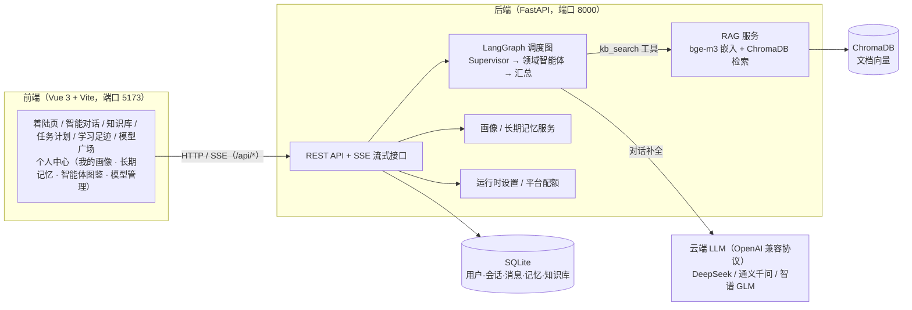
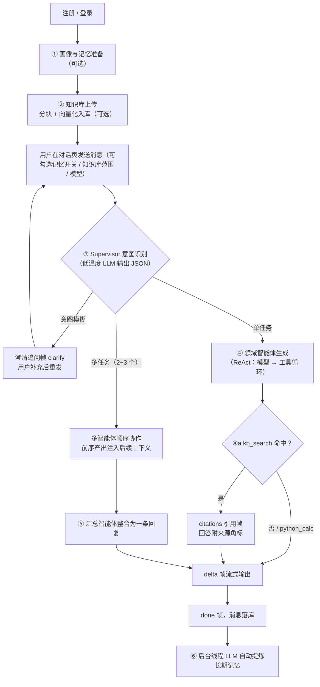

# 智学方舟（Campus Multi-Agent OS）产品文档

> 一款面向大学生的校园多智能体 AI 平台：一个统一聊天入口，五位领域智能体共享一份用户画像与长期记忆，由调度智能体自动拆解任务、知识库回答自带引用溯源。
>
> **文档包含四部分**：① 项目简介与产品定位　② 启动方式与环境变量说明　③ 核心使用流程与 AI 介入环节说明　④ 技术栈清单

---

## 一、项目简介与产品定位

### 1.1 一句话定位

**「大学里的事，交给一艘方舟。」** 智学方舟把大学生日常会遇到的学业、竞赛、科研、求职、生活五类问题，收拢进一个对话式入口：用户只管提问，平台背后的调度智能体（Supervisor）自动识别意图、拆解任务、分派给对应领域智能体协作完成。

### 1.2 解决什么问题

大学生的问题天然横跨多个领域（例如「期末周同时要备数学建模国赛」横跨学业与竞赛），市面上的单一聊天机器人要么不接地气，要么需要在多个工具间来回切换。智学方舟不做五个孤立 App，而是提供：

| 能力 | 说明 |
| --- | --- |
| 统一入口 | 一次提问即可，无需选择「该问谁」；意图模糊时智能体会先澄清追问 |
| 五位领域智能体 | 学习助手 / 竞赛指导 / 科研助手 / 求职指导 / 生活服务，另设通用助手兜底 |
| 可解释的调度 | LangGraph 状态图驱动，任务规划、分发、工具调用全部以时间线形式对用户透明 |
| 私有知识可溯源 | 上传课件/讲义到知识库，回答附引用角标，可核查原文片段与相似度分数，抑制幻觉 |
| 画像与记忆共享 | 用户画像与长期记忆被所有智能体共享，跨会话延续；对话结束后自动提炼新记忆 |

### 1.3 目标用户与使用场景

- **目标用户**：在校大学生（本科为主）。
- **典型场景**：期末复习规划、竞赛选择与备赛时间线、文献阅读与论文写作、实习校招简历面试、选课/社团/办事流程等校园 FAQ。
- **使用方式**：浏览器打开即用（Vue 3 单页应用），对话全程流式输出。

### 1.4 系统架构



图 1：智学方舟系统架构图——前端经 /api 代理访问 FastAPI，LangGraph 调度图统一编排 LLM 调用与 RAG 工具，结构化数据落 SQLite、向量落 ChromaDB。

---

## 二、启动方式与环境变量说明

### 2.1 三行启动（本地运行）

```bash
# ① 后端：装依赖、配 Key、起服务（8000 端口）
cd backend && cp .env.example .env && pip install -r requirements.txt && uvicorn app.main:app --port 8000

# ② 前端：装依赖、起开发服务器（5173 端口，/api 自动代理到 8000）
cd frontend && npm install && npm run dev

# ③ 唯一必需环境变量：在 backend/.env 中填入任一家供应商 Key（其余均可选）
LLM_PROVIDER=deepseek        # 默认供应商：deepseek / qwen / glm
DEEPSEEK_API_KEY=sk-xxxx     # 未填时自动回落 FALLBACK_PROVIDER（默认 glm 免费档）
```

浏览器访问 `http://localhost:5173` 即可使用。首次启动自动建表并初始化 SQLite（`backend/data/app.db`）与 ChromaDB（`backend/data/chroma`）目录。

### 2.2 全量环境变量说明（backend/.env）

| 变量 | 默认值 | 作用 |
| --- | --- | --- |
| `LLM_PROVIDER` | `deepseek` | 默认供应商：`deepseek` / `qwen` / `glm` |
| `FALLBACK_PROVIDER` | `glm` | 兜底供应商：所选供应商未配置 Key 时自动切换到它 |
| `DEEPSEEK_API_KEY` / `_BASE_URL` / `_MODEL` | 空 / `https://api.deepseek.com/v1` / `deepseek-chat` | DeepSeek 接入参数 |
| `QWEN_API_KEY` / `_BASE_URL` / `_MODEL` | 空 / `https://dashscope.aliyuncs.com/compatible-mode/v1` / `qwen-plus` | 通义千问（阿里云百炼，OpenAI 兼容模式） |
| `GLM_API_KEY` / `_BASE_URL` / `_MODEL` | 空 / `https://open.bigmodel.cn/api/paas/v4` / `glm-4-flash` | 智谱 GLM（永久免费档，兜底首选） |
| `HOST` / `PORT` | `0.0.0.0` / `8000` | 后端监听地址与端口 |
| `DATABASE_URL` | `sqlite:///./data/app.db` | 关系库连接串（SQLite 单文件） |
| `KB_EMBED_MODEL` | `BAAI/bge-m3` | 知识库嵌入模型（CPU 推理，可换 bge-small-zh-v1.5 提速） |
| `KB_CHUNK_SIZE` / `KB_CHUNK_OVERLAP` | `500` / `80` | 文档分块目标字符数 / 相邻块重叠 |
| `KB_TOP_K` / `KB_MIN_SCORE` | `3` / `0.35` | 检索返回条数 / 相似度阈值（低于不作为引用） |
| `CHROMA_DIR` | `backend/data/chroma` | 向量库持久化目录 |

**密钥两级机制**：① `.env` 平台级 Key 随服务部署预置，付费供应商（DeepSeek / 千问）每日限 20 次体验（代码常量 `PLATFORM_DAILY_LIMIT`），GLM 免费 Key 不限量；② 用户在「个人中心 → 模型管理」填写的 BYOK（自带 Key）存入数据库，**优先级高于 .env、写入即生效、掩码回显、不限量**。两者皆无时发起对话会返回引导配置的提示。

### 2.3 线上部署方式

生产部署为「静态前端 + 反向代理后端」的标准形态：`npm run build` 产出 `frontend/dist/` 静态资源，托管至 Nginx / Caddy / 对象存储，并将 `/api` 反向代理到 `uvicorn app.main:app --port 8000` 进程（可用 systemd 守护）；数据层为单文件 SQLite + 内嵌 ChromaDB，无需额外数据库服务。SQLAlchemy ORM 层不变，可平替 PostgreSQL。

---

## 三、核心使用流程与 AI 介入环节说明

### 3.1 一条端到端用户路径（4 步走通）

> **① 访问** `http://localhost:5173`，注册 / 登录 → **② 在聊天框输入**「这道二叉树题帮我讲讲」（保持底部「知识库 · 检索开」「记忆 · 运用开」）→ **③ 观察回答上方的调度时间线实时推进**：Supervisor 识别意图 → 分派学习助手 → 自动检索知识库（命中 1 段）→ DeepSeek 流式生成回答 → **④ 获得带「参考来源 [1]」角标的回答**：点击角标核查知识库原文、点赞/点踩反馈、或一键「✦ 转为我的计划」把建议沉淀为可跟踪待办。

### 3.2 完整流程与 6 个 AI 介入环节



图 2：核心对话流程与 AI 介入环节图——③④⑤⑥ 为运行期 LLM 参与环节，①② 为准备期 AI 处理环节；所有过程经 SSE 帧实时推送前端时间线。

**① 用户画像与长期记忆（准备期 · AI 参与）**：用户在「个人中心 → 画像」填写结构化背景；对话历史由后台线程调用 LLM 自动提炼为「主体-属性」结构化二元组写入长期记忆。读取侧按与当前话题的重合度检索 TopN 注入上下文（非全量塞入），画像 + 记忆统一注入调度图共享状态，五位智能体全部感知。输入框左下角「🔖 记忆 N 条」胶囊可一键开关记忆运用。

**② 知识库上传与向量化（准备期 · AI 参与）**：知识库页上传 PDF / Word / PPT / Markdown / TXT（≤ 10MB），后端自动「文本抽取 → 500 字符/80 重叠分块 → bge-m3 CPU 向量化 → 写入 ChromaDB」。对话前可勾选检索范围，也可整体关闭。

**③ Supervisor 意图识别与任务规划（运行期 · LLM）**：每条消息先经调度智能体，只看最近 4 条消息 + 画像记忆背景，低温度（0.1）输出结构化 JSON 二选一：`{"action":"plan","tasks":[...]}`（最多拆 3 个任务，agent 限定六位智能体 key）或 `{"action":"clarify","questions":[...]}`（意图模糊且无法合理默认时追问，每轮最多 1 次）。解析层容错（非法 agent 回落通用助手），调度失败不阻塞对话。

**④ 领域智能体生成 + ReAct 工具循环（运行期 · LLM + 工具）**：被选中的智能体携带「人设 + 统一风格 + 画像记忆 + 任务目标 + 前序产出」生成回答；绑定工具的智能体（学习助手 / 科研助手）走 ReAct 循环（上限 3 轮）：`kb_search` 向量检索知识库并随 `citations` 帧返回结构化引用（文档名、原文片段、相似度，低于 0.35 不硬凑引用）；`python_calc` 本地安全求值数学表达式。

**⑤ 多智能体协作与汇总（运行期 · LLM）**：复合请求（如「竞赛 + 考试双线安排」）拆成 2~3 个任务后顺序执行，前序产出注入后续智能体上下文（供衔接、禁止重复），最后由汇总智能体（温度 0.3）整合为一条含整体思路、分点结论与下一步行动建议的连贯回复。

**⑥ 记忆沉淀与全流程可视化（运行期 · LLM + SSE）**：回合结束后后台线程用 LLM 提炼新记忆，下次对话自动生效；全程 SSE 推送结构化帧：`meta` → `clarify` / `plan`（调度决策）→ `agent_start` → `tool`（工具调用摘要）→ `citations`（引用）→ `delta`（增量文本）→ `status`（供应商回落 / 配额提示）→ `done` / `error`，前端渲染为回答上方的可解释时间线。

### 3.3 支撑页面与容错降级

| 页面 | 作用 |
| --- | --- |
| 智能对话（01） | 主链路：模型切换、记忆运用开关、知识库范围勾选、调度时间线、引用角标 |
| 知识库（02） | 文档上传（两阶段）、文档/分块管理、检索试验台 |
| 任务计划（03） | 对话产出的行动计划沉淀为待办步骤，「待办聚焦」按截止日紧急度排序 |
| 学习足迹（04） | 近 14 天对话趋势、智能体使用分布、引用命中、活跃天数、薄弱点分析 |
| 模型广场（05） | 三家供应商模型卡片：设为默认（与个人中心同源）、测试连通与延迟排行 |
| 个人中心 | 四个 Tab：我的画像 / 长期记忆 / 智能体图鉴 / 模型管理（BYOK、默认切换、用量分布） |

**容错与降级**：未配置任何 Key 时推送单条 error 帧引导配置；供应商故障自动回落 `FALLBACK_PROVIDER` 并以 `status` 帧告知；平台配额用尽推送「今日平台体验次数已用完（20/20）」并引导配置个人 Key；工具轮次耗尽强制模型基于已获信息收尾，保证必有回答。

---

## 四、技术栈清单

### AI 层（多智能体调度 + 大模型 + RAG）

| 组件 | 版本 | 用途 |
| --- | --- | --- |
| LangGraph | ≥ 0.2 | 状态图编排：Supervisor → 条件边路由 → 领域智能体 → 汇总；自定义流推送时间线事件 |
| LangChain OpenAI | ≥ 0.3 | OpenAI 兼容对话模型接入与 `bind_tools` 工具绑定（ReAct 循环） |
| 云端 LLM | DeepSeek `deepseek-chat` / 通义千问 `qwen-plus` / 智谱 `glm-4-flash` | 三供应商可切换、自动回落，OpenAI 兼容协议 |
| sentence-transformers + PyTorch（CPU） | ≥ 3.0 / ≥ 2.2 | 加载 `BAAI/bge-m3` 中文嵌入模型，纯 CPU 推理 |
| ChromaDB | ≥ 0.5 | 嵌入式向量库，余弦相似度持久化检索（RAG 知识库） |
| pypdf / python-docx / python-pptx | ≥ 4.0 / ≥ 1.1 / ≥ 0.6 | PDF / Word / PPT 文本抽取 |

### 服务层（前端 + 后端服务）

| 组件 | 版本 | 用途 |
| --- | --- | --- |
| Vue 3 | ^3.5（Composition API） | 单页应用：着陆页 / 智能对话 / 知识库 / 任务计划 / 学习足迹 / 模型广场 / 个人中心 |
| Vite | ^6.3 | 开发服务器（/api 代理）与生产构建 |
| 原生 CSS + Element Plus（仅 ElMessage） | ^2.9 | 全站自定义视觉体系与轻提示 |
| FastAPI | ≥ 0.115 | Web 框架，REST + SSE 流式接口 |
| Uvicorn | ≥ 0.30 | ASGI 服务器 |
| SQLAlchemy | ≥ 2.0 | ORM（用户、会话、消息、记忆、知识文档、平台设置） |
| Pydantic / pydantic-settings | ≥ 2.7 / ≥ 2.3 | 请求模型与 .env 配置管理 |

### 部署层（存储 + 运行时）

| 组件 | 说明 |
| --- | --- |
| SQLite | 单文件关系库（`data/app.db`），零运维，ORM 层不变可平替 PostgreSQL |
| ChromaDB 嵌入式模式 | 向量持久化目录（`data/chroma`），无独立向量服务 |
| Uvicorn + Nginx/Caddy 反代 | 前端 `npm run build` 静态托管 + `/api` 反向代理到 uvicorn 进程（systemd 守护） |
| 认证 | PBKDF2 口令摘要 + HMAC 签名 Token（7 天有效），`Bearer` 鉴权 |
| 运行环境 | Python 3.11+ / Node.js 18+，**纯 CPU 可运行，无 GPU 与外部中间件依赖** |

---

*文档对应代码版本：v0.1.0（2026-09）。*
