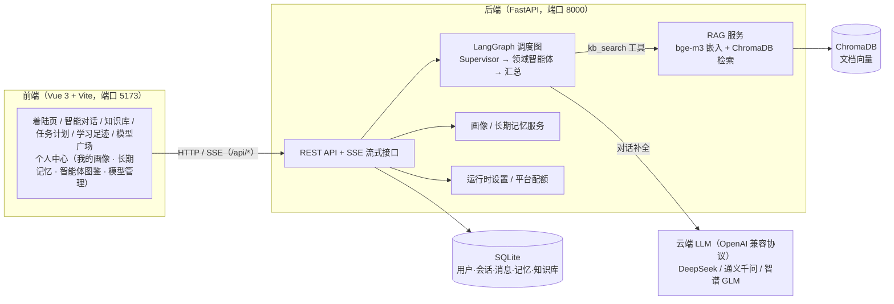
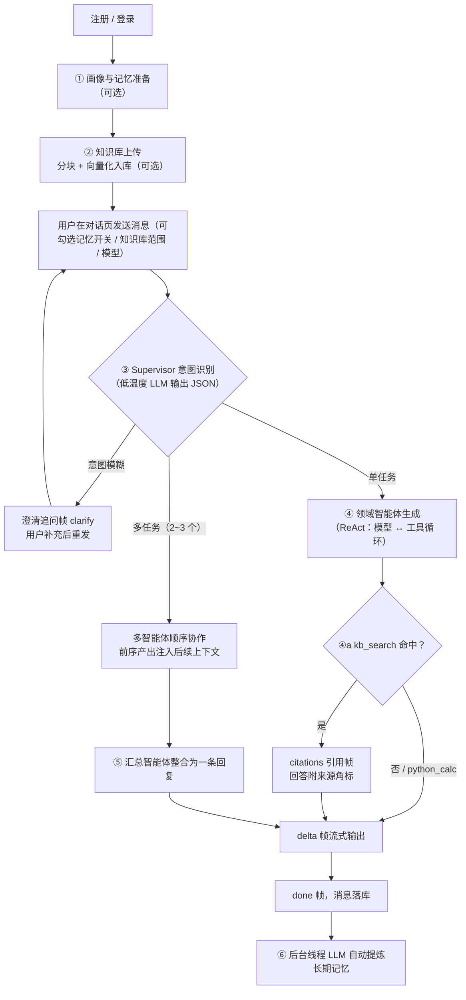

# 智学方舟（Campus Multi-Agent OS）产品文档

> 一款面向大学生的校园多智能体 AI 平台：一个统一聊天入口，五位领域智能体共享一份用户画像与长期记忆，由调度智能体自动拆解任务、知识库回答自带引用溯源。

---

## 一、项目简介与产品定位

### 1.1 一句话定位

**「大学里的事，交给一艘方舟。」** 智学方舟把大学生日常会遇到的学业、竞赛、科研、求职、生活五类问题，收拢进一个对话式入口：用户只管提问，平台背后的调度智能体（Supervisor）自动识别意图、拆解任务、分派给对应领域智能体协作完成。

### 1.2 解决什么问题

大学生的问题天然横跨多个领域（例如「期末周同时要备数学建模国赛」横跨学业与竞赛），市面上的单一聊天机器人要么不接地气，要么需要用户在多个工具之间来回切换。智学方舟不做五个孤立 App，而是提供：

| 能力 | 说明 |
| --- | --- |
| 统一入口 | 一次提问即可，无需选择「该问谁」；意图模糊时智能体会先澄清追问 |
| 五位领域智能体 | 学习助手 / 竞赛指导 / 科研助手 / 求职指导 / 生活服务，另设通用助手兜底 |
| 可解释的调度 | LangGraph 状态图驱动，任务规划、任务分发、工具调用全部以时间线形式对用户透明 |
| 私有知识可溯源 | 上传课件/讲义到知识库，回答附引用角标，hover 可见原文片段与相似度分数，抑制幻觉 |
| 画像与记忆共享 | 用户画像与长期记忆被所有智能体共享，跨会话延续；对话结束后自动提炼新记忆 |

### 1.3 目标用户与使用场景

- **目标用户**：在校大学生（本科为主）。
- **典型场景**：期末复习规划、竞赛选择与备赛时间线、文献阅读与论文写作、实习校招简历面试、选课/社团/办事流程等校园 FAQ。
- **使用方式**：浏览器打开即用（Vue 3 单页应用），对话全程流式输出。

### 1.4 产品形态与系统架构

系统为前后端分离的单机可部署形态：前端 Vue 3 SPA 负责交互与可视化，后端 FastAPI 提供 REST + SSE 流式接口，LangGraph 编排多智能体调度图，RAG 与记忆数据全部本地持久化（SQLite + ChromaDB），**纯 CPU 即可运行，不依赖 GPU 与云服务**。



图 1：智学方舟系统架构图——前端经 /api 代理访问 FastAPI，LangGraph 调度图统一编排 LLM 调用与 RAG 工具，结构化数据落 SQLite、向量落 ChromaDB。

---

## 二、启动方式与环境变量说明

### 2.1 环境准备

- Python 3.11+、Node.js 18+
- CPU-only 环境即可运行（嵌入模型 bge-m3 走 CPU 推理，无需 GPU）
- 国内网络建议先设置 HuggingFace 镜像，避免下载 bge-m3 超时：

```bash
# Windows (PowerShell)
$env:HF_ENDPOINT = "https://hf-mirror.com"
$env:HF_HUB_DISABLE_XET = "1"
```

### 2.2 后端启动（FastAPI，端口 8000）

```bash
cd backend

# 1) 安装依赖（torch 请装 CPU 版，避免拉取 CUDA 大包）
pip install -r requirements.txt
pip install torch --index-url https://download.pytorch.org/whl/cpu

# 2) 配置环境变量：复制模板为 .env 并填入至少一家供应商的 API Key
cp .env.example .env    # Windows 用 copy

# 3) 启动（首次启动自动建表、初始化 SQLite 与 ChromaDB 目录）
uvicorn app.main:app --host 0.0.0.0 --port 8000
```

健康检查：`curl http://127.0.0.1:8000/api/health` 返回 `{"status":"ok",...}` 即启动成功。

### 2.3 前端启动（Vue 3 + Vite，端口 5173）

```bash
cd frontend
npm install
npm run dev          # 开发模式：http://localhost:5173（/api 自动代理到 127.0.0.1:8000）
npm run build        # 生产构建：产物在 dist/，可静态托管，将 /api 反代到后端
```

### 2.4 环境变量说明（backend/.env）

| 变量 | 默认值 | 说明 |
| --- | --- | --- |
| `LLM_PROVIDER` | `deepseek` | 默认供应商：`deepseek` / `qwen` / `glm` |
| `FALLBACK_PROVIDER` | `glm` | 兜底供应商：所选供应商未配置 Key 时自动切换到它 |
| `DEEPSEEK_API_KEY` / `_BASE_URL` / `_MODEL` | 空 / `https://api.deepseek.com/v1` / `deepseek-chat` | DeepSeek 接入参数（主力） |
| `QWEN_API_KEY` / `_BASE_URL` / `_MODEL` | 空 / `https://dashscope.aliyuncs.com/compatible-mode/v1` / `qwen-plus` | 通义千问（阿里云百炼，OpenAI 兼容模式） |
| `GLM_API_KEY` / `_BASE_URL` / `_MODEL` | 空 / `https://open.bigmodel.cn/api/paas/v4` / `glm-4-flash` | 智谱 GLM（永久免费档，兜底首选） |
| `HOST` / `PORT` | `0.0.0.0` / `8000` | 后端监听地址与端口 |
| `DATABASE_URL` | `sqlite:///./data/app.db` | 关系库连接串（SQLite 单文件） |
| `KB_EMBED_MODEL` | `BAAI/bge-m3` | 知识库嵌入模型（可换 bge-small-zh-v1.5 提速） |
| `KB_CHUNK_SIZE` / `KB_CHUNK_OVERLAP` | `500` / `80` | 文档分块的目标字符数 / 相邻块重叠 |
| `KB_TOP_K` / `KB_MIN_SCORE` | `3` / `0.35` | 检索返回条数 / 相似度阈值（低于不作为引用） |
| `CHROMA_DIR` | `backend/data/chroma` | 向量库持久化目录 |

**密钥的两级配置**：

1. **`.env` 平台级 Key**：随服务部署预置。付费供应商（DeepSeek / 千问）按供应商分桶**每日限 20 次**（代码常量 `PLATFORM_DAILY_LIMIT`，重启清零）；GLM 免费 Key 不限量。
2. **运行时 BYOK（Bring Your Own Key）**：用户在「个人中心 → 模型管理」填写的 Key 存入数据库（`PlatformSetting` 表），**优先级高于 .env、写入即生效（无需重启）、掩码回显、不限量使用**。两者都未配置时发起对话，接口直接返回提示「未配置 API 密钥，请到个人中心 → 模型管理配置」。

---

## 三、核心使用流程与 AI 介入环节说明

主链路共 **6 个 AI 介入环节**，下图为总览，随后逐环节展开。



图 2：核心对话流程与 AI 介入环节图——③④⑤⑥ 为运行期 LLM 参与环节，①② 为准备期 AI 处理环节；所有过程经 SSE 帧实时推送前端时间线。

### 环节 ①：用户画像与长期记忆（准备期 · AI 参与）

用户在「个人中心 → 画像」填写专业、年级、目标等结构化画像；对话历史由后台线程调用 LLM 自动提炼为「主体-属性」结构化二元组存入长期记忆。输入框左下角「🔖 记忆 N 条」胶囊可一键开关**记忆运用**。

- **AI 介入点**：记忆提炼（写入侧）由 LLM 完成；读取侧按与当前话题的重合度打分检索 TopN 注入上下文，而非全量塞入。
- **跨智能体共享**：画像 + 记忆统一注入调度图共享状态 `AgentState.context`，五位智能体全部感知（例如求职时自动带上「大三、计算机专业」背景）。

### 环节 ②：知识库上传与向量化（准备期 · AI 参与）

「知识库」页上传 PDF / Word / PPT / Markdown / TXT 文件（≤ 10MB），后端两阶段处理：字节上传 → 文本抽取 → 按 500 字符 / 80 重叠分块 → bge-m3 CPU 向量化写入 ChromaDB。

- **AI 介入点**：嵌入模型向量化。进程级单例 + 线程锁惰性加载，首次加载后常驻内存。
- 对话前可勾选检索范围（仅勾选文档参与检索），也可整体关闭知识库开关。

### 环节 ③：Supervisor 意图识别与任务规划（运行期 · LLM）

每条用户消息首先进入调度智能体：只看最近 4 条消息 + 用户画像记忆背景，**低温度（0.1）输出结构化 JSON**，二选一：

- `{"action":"plan","tasks":[{"agent":"study","objective":"生成复习计划"},...]}` —— 最多拆 3 个任务，agent 只能从六位智能体 key 中选择；
- `{"action":"clarify","questions":["备考的是数学建模国赛还是期末考？"]}` —— 意图模糊且无法合理默认时追问（每轮最多 1 次，寒暄/事实问答禁止追问）。

解析层做了容错（兼容旧版格式、非法 agent 回落通用助手），调度失败不阻塞对话。

### 环节 ④：领域智能体生成 + ReAct 工具循环（运行期 · LLM + 工具）

被选中的领域智能体携带「人设 + 平台统一风格 + 画像记忆 + 任务目标 + 前序智能体产出」生成回答。绑定工具的智能体（学习助手 / 科研助手）走 **ReAct 循环（上限 3 轮）**：

- `kb_search`：向量检索知识库，命中段注入上下文，并随 `citations` 帧返回结构化引用（文档名、原文片段、相似度分数）→ 前端渲染为回答下方的**来源角标**，hover 可核查原文，低于 0.35 相似度不硬凑引用；
- `python_calc`：本地安全求值数学表达式。

### 环节 ⑤：多智能体协作与汇总（运行期 · LLM）

复合请求（如「竞赛 + 考试双线安排」）被拆成 2~3 个任务后，按顺序执行：前序产出注入后续智能体上下文（供衔接、禁止重复），最后由汇总智能体（低温度 0.3）整合为一条含整体思路、分点结论与下一步行动建议的连贯回复（≤ 300 字）。

### 环节 ⑥：记忆沉淀与全流程可视化（运行期 · LLM + SSE）

- 回合结束后后台线程用 LLM 从对话提炼新记忆，下次对话自动生效；
- 全程通过 SSE 推送结构化帧：`meta`（会话）→ `clarify` / `plan`（调度决策）→ `agent_start`（任务开始）→ `tool`（工具调用摘要）→ `citations`（引用）→ `delta`（增量文本）→ `status`（供应商回落 / 配额提示）→ `done` / `error`。前端将调度、工具、引用渲染为回答上方的**可解释时间线**。

### 支撑页面（非对话主链路）

| 页面 | 作用 |
| --- | --- |
| 智能对话（01） | 主链路对话：模型切换、记忆运用开关、知识库范围勾选、调度时间线、引用角标 |
| 知识库（02） | 文档上传（两阶段：上传 → 向量化）、文档/分块管理、检索预览 |
| 任务计划（03） | 对话产出的行动计划沉淀为待办步骤，「待办聚焦」按截止日紧急度排序跟踪 |
| 学习足迹（04） | 近 14 天对话趋势、智能体使用分布、引用命中、活跃天数、薄弱点分析 |
| 模型广场（05） | 三家供应商模型卡片（上下文/能力/计费）：设为默认（与个人中心同源）、一键测试连通与延迟排行 |
| 个人中心 | 四个 Tab：**我的画像**（结构化背景）、**长期记忆**（记忆增删与管理）、**智能体图鉴**（五助手档案 + 能力雷达）、**模型管理**（BYOK 密钥配置、默认供应商切换、模型用量分布） |

### 容错与降级

- **未配置任何 Key**：接口直接推送单条 error 帧「未配置 API 密钥，请到个人中心 → 模型管理配置」，引导用户完成 BYOK 配置；
- **供应商故障 / 未接入**：自动回落 `FALLBACK_PROVIDER` 并以 `status` 帧告知用户；
- **平台配额用尽**：推送「今日平台体验次数已用完（20/20）」并引导配置个人 Key；
- **工具轮次耗尽**：强制模型基于已获信息收尾，保证必有回答。

---

## 四、技术栈清单

### 4.1 前端

| 技术 | 版本 | 用途 |
| --- | --- | --- |
| Vue 3 | ^3.5（Composition API） | 单页应用框架（着陆页 / 智能对话 / 知识库 / 任务计划 / 学习足迹 / 模型广场 / 个人中心） |
| Vite | ^6.3 | 开发服务器（/api 代理）与生产构建 |
| 原生 CSS | — | 全站视觉（白色柔粉编辑风自定义设计体系） |
| Element Plus | ^2.9 | 仅使用 ElMessage 轻提示，不引入整套主题 |

### 4.2 后端

| 技术 | 版本 | 用途 |
| --- | --- | --- |
| FastAPI | ≥ 0.115 | Web 框架，REST + SSE 流式接口 |
| Uvicorn | ≥ 0.30 | ASGI 服务器 |
| SQLAlchemy | ≥ 2.0 | ORM（SQLite，单文件 `data/app.db`） |
| Pydantic / pydantic-settings | ≥ 2.7 / ≥ 2.3 | 请求模型与 .env 配置管理 |
| python-multipart | ≥ 0.0.9 | 知识库文件上传 |

### 4.3 多智能体调度

| 技术 | 版本 | 用途 |
| --- | --- | --- |
| LangGraph | ≥ 0.2 | 状态图编排：Supervisor → 条件边路由 → 领域智能体 → gate → 汇总；custom 流推送时间线事件 |
| LangChain OpenAI | ≥ 0.3 | OpenAI 兼容对话模型接入与 `bind_tools` 工具绑定（ReAct 循环） |

### 4.4 LLM 供应商（OpenAI 兼容协议，可切换 / 自动回落）

| 供应商 | 模型 | 定位 |
| --- | --- | --- |
| DeepSeek | `deepseek-chat` | 主力（付费自用，低成本） |
| 阿里云通义千问 | `qwen-plus` | 备选（百炼赠金 / BYOK） |
| 智谱 AI | `glm-4-flash` | 永久免费档，平台兜底首选 |

### 4.5 RAG 知识库（CPU-only）

| 技术 | 版本 | 用途 |
| --- | --- | --- |
| PyTorch | ≥ 2.2（CPU 版） | 嵌入模型推理后端，无 GPU 依赖 |
| sentence-transformers | ≥ 3.0 | 加载 `BAAI/bge-m3` 中文嵌入模型 |
| ChromaDB | ≥ 0.5 | 嵌入式向量库，余弦相似度持久化检索 |
| pypdf / python-docx / python-pptx | ≥ 4.0 / ≥ 1.1 / ≥ 0.6 | PDF / Word / PPT 文本抽取 |

### 4.6 数据与部署形态

- **存储**：SQLite（用户、会话、消息、记忆、知识文档、平台设置）+ ChromaDB（文档向量，`data/chroma`），全部本地文件，零运维；
- **部署**：单机形态，前端 `npm run build` 静态产物 + 后端 uvicorn，纯 CPU 可运行；SQLAlchemy ORM 层不变，生产可平替 PostgreSQL；
- **认证**：PBKDF2 口令摘要 + HMAC 签名 Token（7 天有效），`/api/auth/*` 注册登录，`Bearer` 鉴权。

---

*文档对应代码版本：v0.1.0（2026-09）。*
